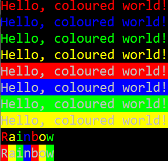

# Coloured Console 🌈
A light-weight, C++, header-only library for writing coloured text in the console!



[Try it.](demo/Demo.exe)

## Example Usage

### Basic Program
```c++
#include <iostream>
#include "colors.hpp"

int main() {
    colors::init_console();
    std::cout << colors::red << "Hello, world!" << colors::reset;
    return 0;
}
```

### Built-in Colours
```c++
// Foreground
std::cout << colors::red << "Hello, world!" << colors::reset;
// Background
std::cout << colors::blue_bg << "Hello, world!" << colors::reset;
// Both together
std::cout << colors::red << colors::blue_bg << "Hello, world!" << colors::reset;
```

### RGB Colours
```c++
// Foreground
std::cout << colors::rgb(255, 0, 0) << "Hello, world!" << colors::reset;
// Background
std::cout << colors::rgb(0, 0, 255, true) << "Hello, world!" << colors::reset;
// Both together
std::cout << colors::rgb(255, 0, 0) << colors::rgb(0, 0, 255, true) << "Hello, world!" << colors::reset;
```

### Styles
```c++
// Rainbow
// Foreground
std::cout << colors::style::rainbow("Hello, world!") << colors::reset;
// Background
std::cout << colors::style::rainbow("Hello, world!", true) << colors::reset;
// Both together
std::cout << colors::style::rainbow("Hello, world!") << colors::style::rainbow("Hello, world!", true) << colors::reset;
```

## Notes

- Only tested on Windows
- `colors::init_console()` may not work in C

## Licence
[GPLv3](LICENCE.txt)
